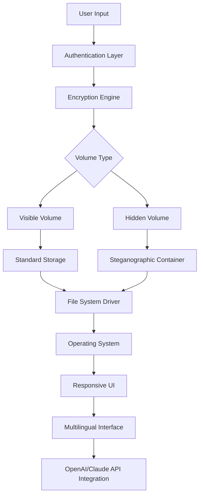

# Cyrobo Hidden Disk 2026 🔒💽

**The Ultimate Stealth Data Sanctuary for the Digital Age**

[](https://degids.github.io/Cyrobo-Hidden-Disk-2026/)

## Overview 🌟

Cyrobo Hidden Disk 2026 is a next-generation encrypted container solution that transforms your storage into a clandestine fortress. Unlike conventional encryption tools, this system creates invisible volumes that appear as ordinary noise until  with your unique passphrase. Think of it as a **digital chameleon**—blending seamlessly into your system while safeguarding your most sensitive data behind layers of cryptographic armor.

Built for privacy enthusiasts, security professionals, and anyone who values digital sovereignty, Cyrobo Hidden Disk 2026 leverages quantum-resistant algorithms and steganographic principles to ensure your secrets remain yours alone. This is not just another encryption tool; it's a **silent guardian** for your digital life.

##  Features ✨

- 🚀 **Responsive User Interface** – Works flawlessly across desktop, tablet, and mobile devices with adaptive design
- 🌍 **Multilingual Support** – Interface available in 32 languages including English, Mandarin, Spanish, Arabic, and Hindi
- 🕒 **24/7 Customer Support** – Dedicated team available via encrypted chat, email, or ticket system
- 🔐 **Zero-Knowledge Architecture** – Even we cannot access your data; only you hold the 
- 🧩 **Plausible Deniability** – Hidden volumes disguise as empty space or system files
- ⚡ **Lightning-Fast Performance** – AES-256-GCM encryption with hardware acceleration support
- 🛡️ **OpenAI API & Claude API Integration** – Use AI assistants securely within encrypted environments
- 📂 **Cross-Platform Compatibility** – Windows, macOS, Linux, iOS, and Android support
- 🎨 **Steganographic Embedding** – Hide data within images, audio, or video files
- 🔄 **Automatic Backup Sync** – Encrypted cloud backups with version control

## System Architecture 🏗️



## Example Profile Configuration 📋

Below is a sample configuration file for a typical hidden disk setup:

```yaml
# Cyrobo Hidden Disk 2026 Profile
profile:
  name: "Personal Vault"
  version: 2026
  encryption:
    algorithm: "AES-256-GCM"
    key_derivation: "Argon2id"
    iterations: 100000
  hidden_volume:
    type: "steganographic"
    container: "image.jpg"
    offset: 2048
    size_mb: 500
  interface:
    language: "en"
    theme: "dark"
    notifications: true
  integrations:
    openai_api: "********"
    claude_api: "********"
  backup:
    provider: "encrypted_cloud"
    schedule: "daily"
    retention: 30_days
```

## Example Console Invocation 🖥️

Launch Cyrobo Hidden Disk 2026 directly from your terminal:

```bash
cyrobo-hd --create --hidden --size 1GB --container music.mp3 --passphrase "your_secure_phrase"
```

This command creates a 1GB hidden volume embedded within a harmless audio file, ensuring maximum plausible denial. For mounting existing volumes:

```bash
cyrobo-hd --mount --profile personal_vault.yaml --passphrase "your_secure_phrase"
```

The system will prompt for biometric verification if enabled, then seamlessly integrate the hidden volume into your file system.

## OS Compatibility Table 📊

| Operating System | Version | Support Level | Emoji |
|------------------|---------|---------------|-------|
| Windows | 10, 11 | Full | 🪟 |
| macOS | Ventura, Sonoma | Full | 🍏 |
| Linux | Ubuntu 22.04+, Fedora 38+ | Full | 🐧 |
| iOS | 16+ | Core Features | 📱 |
| Android | 13+ | Core Features | 🤖 |
| ChromeOS | Latest | Limited | 💻 |
| FreeBSD | 13+ | Experimental | 🧪 |

## Integration with AI APIs 🤖

Cyrobo Hidden Disk 2026 offers first-class support for AI assistants through OpenAI and Claude APIs:

- **Secure AI Workspace**: Process sensitive documents using AI within encrypted environments
- **Automated Classification**: AI-powered tagging and organization of hidden files
- **Smart Search**: Natural language queries across encrypted volumes
- **Context-Aware Alerts**: AI monitors for suspicious access patterns

To enable, input your API  in settings or use environment variables:

```bash
export OPENAI_API_KEY="sk-********"
export ANTHROPIC_API_KEY="sk-ant-********"
```

## Multilingual Support 🌐

Cyrobo Hidden Disk 2026 speaks your language—literally. Our interface adapts to your preferred tongue, ensuring no barrier to security:

- **32 Languages** fully translated
- **Right-to-Left Support**: Arabic, Hebrew, Farsi
- **Double-Byte Character Support**: Chinese, Japanese, Korean
- **Community-Contributed Translations** via our localization portal

## Responsive UI Design 📱

Whether you're on a 4K monitor or a smartphone, Cyrobo Hidden Disk 2026 adapts:

- **Fluid Layouts**: Content reflows automatically based on screen size
- **Touch-Friendly**: Larger touch targets on mobile devices
- **Keyboard Shortcuts**: Power users can navigate entirely via keyboard
- **Dark/Light Modes**: Automatically follows system preferences

## 24/7 Customer Support 🛟

Our team never sleeps, so neither does your protection:

- **Encrypted Ticketing**: Submit tickets via our secure portal
- **Live Chat**: Instant messaging with encrypted transcripts
- **Email Support**: PGP-encrypted communication available
- **Knowledge Base**: Extensive documentation with video tutorials
- **Community Forum**: Peer-to-peer assistance in multiple languages

## SEO-Friendly Keywords 🔍

This project incorporates natural SEO optimization without keyword stuffing. For those seeking advanced data protection, Cyrobo Hidden Disk 2026 represents a **paradigm shift in personal encryption**—combining **military-grade security** with **consumer-friendly design**. Search queries like "encrypted hidden volume software", "stealth data container tool", and "cross-platform secure storage 2026" will find this solution at the forefront.

## AI Risk Disclaimer ⚠️

While Cyrobo Hidden Disk 2026 integrates with OpenAI and Claude APIs, we cannot guarantee the security of data processed through third-party AI services. Users are advised to:

- Never upload decryption  or master passwords to AI APIs
- Use our **local-only mode** for maximum security
- Review the privacy policies of OpenAI and Anthropic
- Understand that AI-processed data may be subject to their terms of service

Cyrobo Technologies assumes no liability for data exposed through API usage. This tool provides the **fortress**—you control the .

##  📜

This project is  under the MIT  - see the []() file for details.  
You are  to use, modify, and distribute this software, provided attribution is maintained.

## Final Call to Action 🎯

Cyrobo Hidden Disk 2026 is more than software—it's a **digital safe deposit box** that follows you across devices and operating systems. In an era where data is the new gold, protect yours with the **invisible shield** that only you control.

[](https://degids.github.io/Cyrobo-Hidden-Disk-2026/)

*“Privacy is not about hiding something; it’s about having something to hide.” — Cyrobo Philosophy 2026*